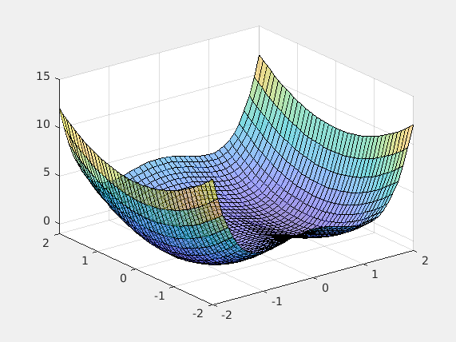
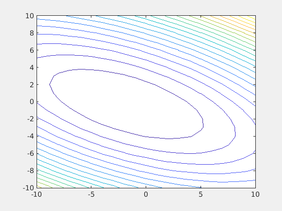
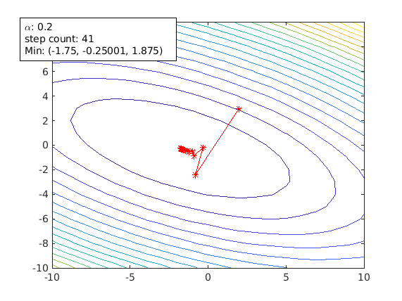
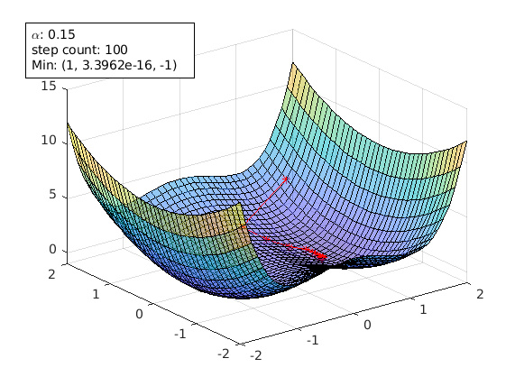
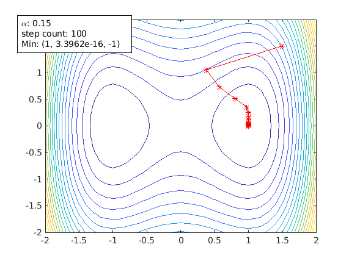
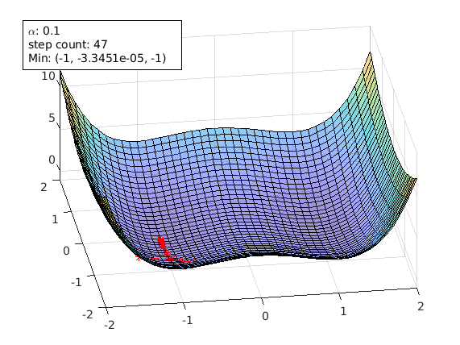
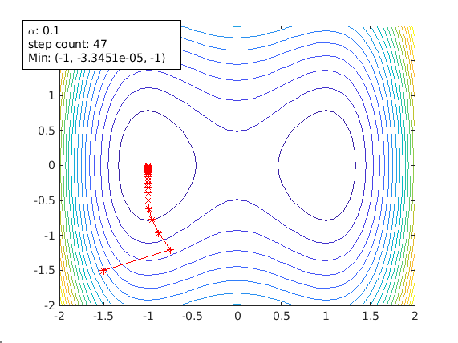
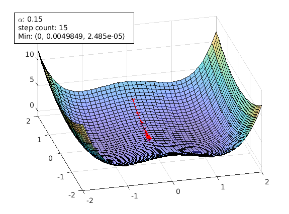
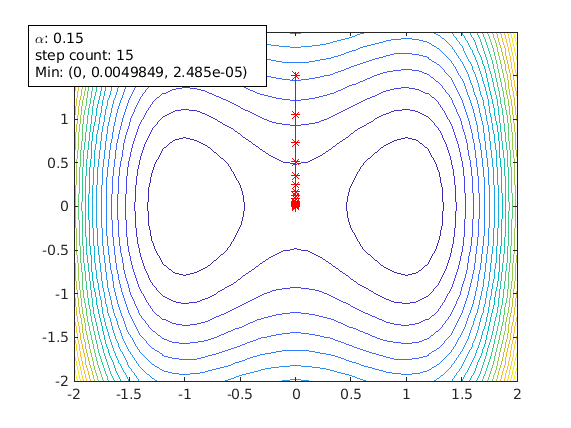

# Animated Gradient Desent
## Overview
Gradient Descent can [be considered](https://builtin.com/data-science/gradient-descent) as one of the most important algorithms in machine learning and deep learning. It is widely
used in training simple machine learning models to complex deep learning networks.

This matlab script can generate an animation gif which visualizes how gradient descent works in a 3D or contour plot. 
This can be very helpful for beginners of machine learning.

In addition, user can set the cost funciton, the learning rate (alpha), and starting point of gradient descent. 
This allows advanced users to demonstrate or investigate the impact of these factors in training a machine learning model.

Please refresh your browser to restart the animation gifs below.
### 3D plot

### Contour plot


Important features:
* Support both 3D surface plot and contour plot
* Allow user to enter the (cost) function to plot
* Allow user to adjust learning rate to understand the effect of it
* Allow user to set starting point of gradient descent, so as to investigate saddle point effect
* Allow user to set the maximum steps and stop threshold
* Generate animation GIF which can be inserted into webpage and presentation

## Usage
Please refer to [test.m](./test.m) for getting started examples.

### instantiate
```
agd = animateGraDes();
```
### Required parameter
Need to set the (cost) function for gradient descent. This is required.
```
agd.funcStr='x^2+2*x*y+3*y^2+4*x+5*y+6';
```
This is the function used to generate the animation GIF of the contour plot above.

If no more optional parameters are needed to set, just call

```
agd.animate();
```

This starts the gradient descent. Once the local min is found, an annotation text box
is shown in the figure. It includes the alpha value being used and the local min it found.

### Optional parameters
All these parameters are optional. If they are not set, the default values are used. Note these need to be
set before calling agd.animate() to take effect.

#### range of plot
This is the range for plotting the function. IMPORTANT, you need to make sure the local min and the start point of 
gradient descent are both within this range. Otherwise they won't be shown. 
You set the x (or y) range by giving the min, the increment, and the max. For example the value below means min=-10, increment=1
and max = 10;

```
agd.xrange = -10:1:10;
agd.yrange = -10:1:10;
```

#### learning rate
Learning rate alpha is an important tuning factor when training a model. By using 
different values of alpha, animateGraDes can show how it affects the training.
For example, if we change alpha from 0.1 to 0.2, we will get this contour plot instead.

```
agd.alpha = 0.2;
```



The first contour plot uses alpha=0.1, and this contour plot shows alpha=0.2. This contour plot shows the effect of overshooting.

Setting alpha greater than 0.3 for this cost function will make gradient descent diverge. It is getting away from the local min, and it will 
never reach there.

The default learning rate is set to 0.1, if not set.

#### starting point
If the starting point is too far away from the local min, it could take a long time for 
gradient descent to reach the local min. In addition, if there are more than one local 
mins, the starting point might decide which local min gradient descent is going to reach.

Starting point is an [x y] array:
```
agd.startPoint=[2 3];
```

By using different function and different starting point, animateGraDes can also show the effect of
saddle points.

The following plots are generated using the example of this [paper](https://www.offconvex.org/2016/03/22/saddlepoints/)
```
agd = animateGraDes();
agd.alpha=0.15;
agd.funcStr='x^4-2*x^2+y^2'; % this the function with saddle points
agd.startPoint=[1.5 1.5];
agd.drawContour=false;
agd.xrange=-2:0.1:2;
agd.yrange=-2:0.1:2;
agd.animate();
```
A starting point of [1.5 1.5] avoids the saddle points and gradient decent can reach the local min [1 0] successfully.




Another starting point of [-1.5 -1.5]. It can also avoid the saddle point. But it ends up in another local min [-1 0].

```
agd.startPoint=[-1.5 -1.5];
```




Now change the starting point to [0 1.5]. This time the starting point is right on the ridge that separates those two local mins.
```
agd.startPoint=[0 1.5];
```
Now gradient descent stops at the saddle point [0 0]:

 

From physics point of view, a local min is a stable balance point, while a saddle point is an unstable balance point. Thus a 
small perturbation can break the balance of an unstable point. This can be used to escape the saddle point.

#### stopThreshold
When gradient descent gets closer to the local min, the gradient is getting smaller and smaller. This means the step gets
shorter when it gets closer to the local min. A stropThreshold can be set to stop gradient descent.

The default is `1E-10`. To get better accuracy set this to a smaller value.

```
agd.stopThreshold = 1E-16;
```
Keep in mind that a smaller stopThreshold can give beeter accuracy, but it will take (much) longer for gradient descent to 
reach the answer.

#### outfile
This optional parameter is used to output an animation gif file. It can be set like this:

```
agd.outfile='animateGraDes.gif';
```
By default, this is empty, and no animation gif will be generated. You can still save the resulted figure into a PNG file.


